# lab2py
## LATIHAN VCS
### Tugas pertemuan ke 4 Bahasa Pemrograman

Nama : Selma Ohoira

NIM : 312210727

Kelas : TI.22.C9

Prodi : Teknik Informatika

# LANGKAH AWAL MENGGUNAKAN GIT
## CARA MENDOWNLOAD GIT
1. Langkah pertama yaitu dengan mendownload git.
   Bukalah situs resmi dari git itu sendiri yaitu git-scm.com
2. Setelah itu langsung saja mendownloadnya dengan cara memilih
   terlebih dahulu yang sesuai dengan laptop/pc yang digunakan.
   Jika itu 32bit silahkan download 32, begitu juga jika 64bit.
   Bisa langsung klik dan akan terdownload secara otomatis.

 

3. Setelah instalisasi terbuka, bisa langsung membuka command prompt
   pada menu windows dan melakukan pengecekan versi dari git kalian
   dengan mengetik syntax: git --version
4. Jika sudah mendapat tampilan seperti gambar dibawah ini artinya git telah berhasil terinstall.

5. Selanjutnya melakukan konfigurasi saat pertama kali menggunakan git.
   Hal ini agar tidak gagal saat melakukan commit. Dengan masukan perintah berikut :

Masukan email dan username

## LANGKAH AWAL MENGGUNAKAN GITHUB
# Login akun Github
1. Buka github pada situs resminya github.com
2. Setelah itu pilih menu SignUp jika memang belum mempunyai akun.
Jika sudah punya akun silahkan langsung SignIn.

Jika sudah berhasil regist, tampilannya akan seperti dibawah ini :

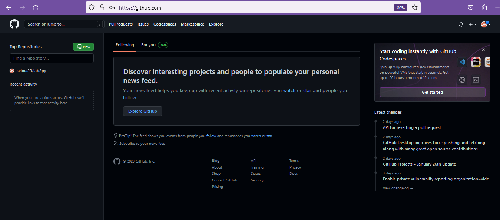

# Langkah membuat REPOSITORY pada GITHUB
1. LogIn akun github
2. Kemudian pilih dibagian start a project,
   atau bisa juga dengan menekan lambang (+) pada pojok bagian kanan atas.
3. Setelah itu tekan New Repository

4. Create judul yang diinginkan dan atur repository
   tersebut besifat privacy atau public.
5. Jika tampilannya seperti dibawah ini, artinya repository sudah berhasil
   dan kalian dapat membukanya pada tulisan README

   Jika ingin menulis sesuatu atau mengedit sebuah teks yang sudah ada sebelumnya
   pada lembar kerja, kalian bisa menekan gambar pensil seperti digambar diatas.
   Dan tekan commit changes untuk menyimpan perubahan pada lembar kerja.
# Setelah repository selesai, selanjutnya cara me-remmote REPOSITORY pada GITBASH lokal
1. Langkah pertama, salin URL git kita yang ada pada Github. Caranya pilih menu Code

2. Setelah link URL git tercopy, selanjutnya buka File Explorer pada windows.
   Kemudian pilih folder mana yang akan kita pakai untuk
   mendownload Repository dari Github ke lokal.

3. Kemudian klik kanan dan tekan perintah 'Git Bash Here'

4. Setelahnya pop Up Command Promp (CMD) akan terbuka. Pada proses ini kita akan melakukan
   download file repository yang tadi dibuat, dengan menggunakan syntax : git clone "link URL Github"

5. Setelah cloning selesai, masukan perintah syntax : cd '(nama folder yang tadi dicloning)/'
   untuk masuk kedalam folder yang telah dicloning.

6. Selanjutnya kita bisa mengedit file README.md yang ada pada File Explorer dengan menggunakan
   Text Editor (Sublime Text, Notepad, Notepad+++, Visual Studio Code).
7. Setelah mengedit, pastikan hasil editan tersimpan.
8. Langkah selanjutnya kembali membuka App GitBash dan masukan perintah
   syntax : 'git add .'

9. Selanjutnya melakukan commit yang dimana fungsi commit adalah untuk menyimpan perubahan
   yang dilakukan, tetapi tidak terjadi perubahan pada remote repository.
   Caranya masukan syntax : 'git commit "keterangan perubahan apa yang dilakukan"'.

10. Setelah git commit selesai, melakukan Git Push yang dimana berfungsi untuk mengirimkan
   perubahan file yang telah dicommit ke remote repository. Caranya masukan syntax : 'git push'
   

JIKA SEMUA PROSES DIATAS SUDAH DILAKUKAN SEMUA TANPA ADA YANG TERLEWAT,
KALIAN BISA LANGSUNG MELIHAT PERUBAHAN REPOSITORY DENGAN MEMBUKANYA
PADA LAMAN GITHUB. SEKIAN & SELAMAT MENCOBA :)

-DONE-

## TUGAS PERTEMUAN KE 5
### MENJALANKAN PYTHON CONSOLE
## Menjumlahkan 2 buah bilangan menggunakan variabel dan b

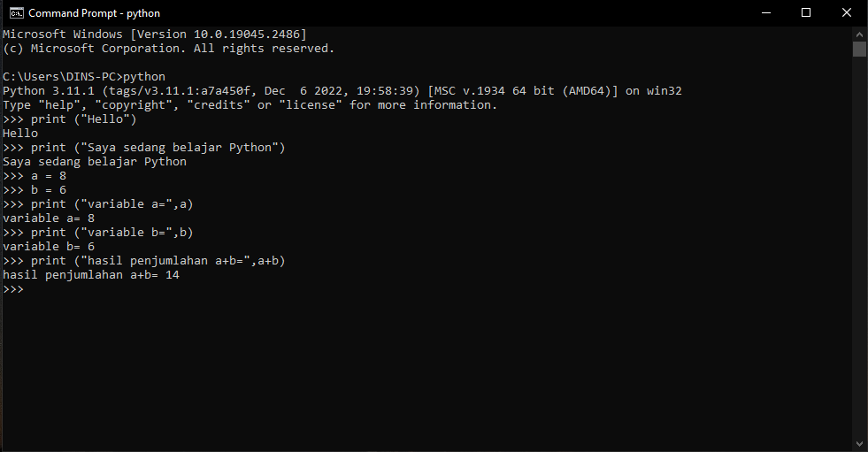

### MENJALANKAN IDLE
## Membuat file baru dengan nama latihan3.py

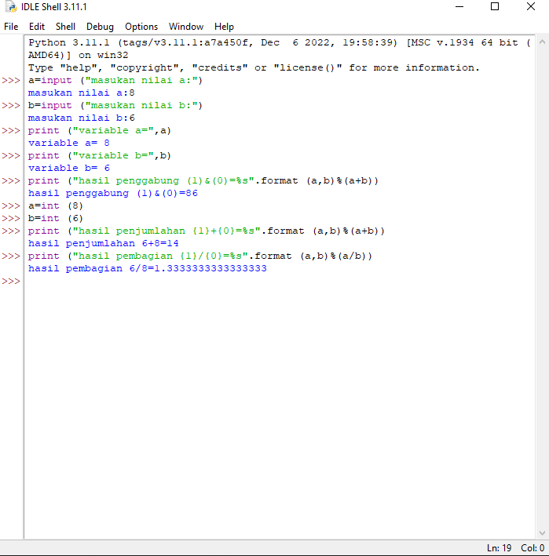

SELESAI!!

# Praktikum-3
## Tugas Bahasa Pemograman pertemuan 6
Langkah-langkahnya yaitu :
1. Install Pycharm di https://www.jetbrains.com/pycharm/download/#section=windows
2. Pilih yang community
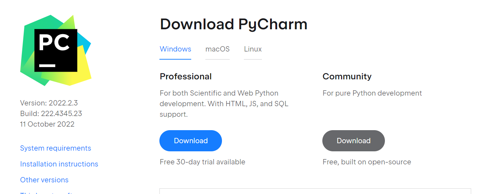
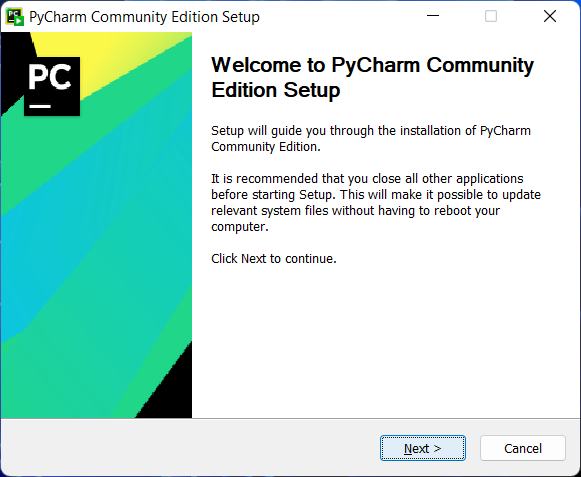
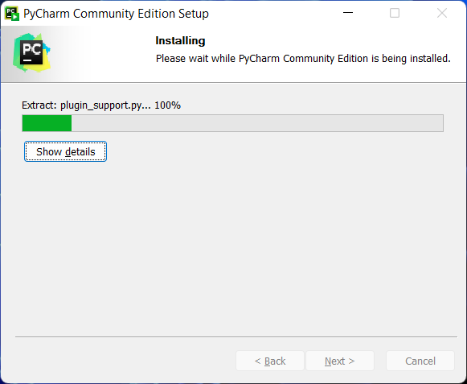

Tunggu hingga selesai, dan program siap digunakan.

### CARA MENJALANKAN PYCHARM
# Latihan 1
1. Klik new project
2. Ketik nama project sesuai yang diinginkan.

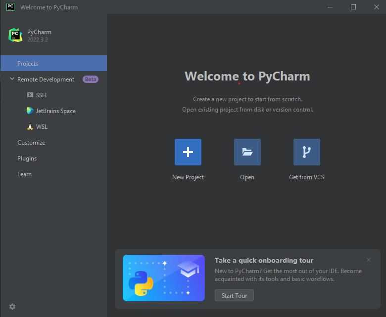

3. Pilih Previously Configurred interperter lalu klik yang "add interperter" dan pilih "System interperter"
4. Pilih yang versi Python, seperti gambar di bawah ini

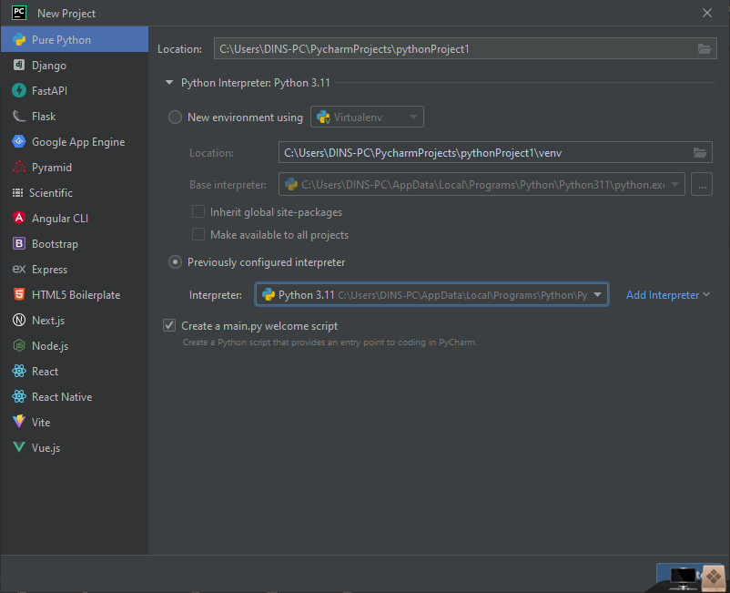

5. Selanjutnya membuat file Phyton baru dan beri nama file "latihan1.py"

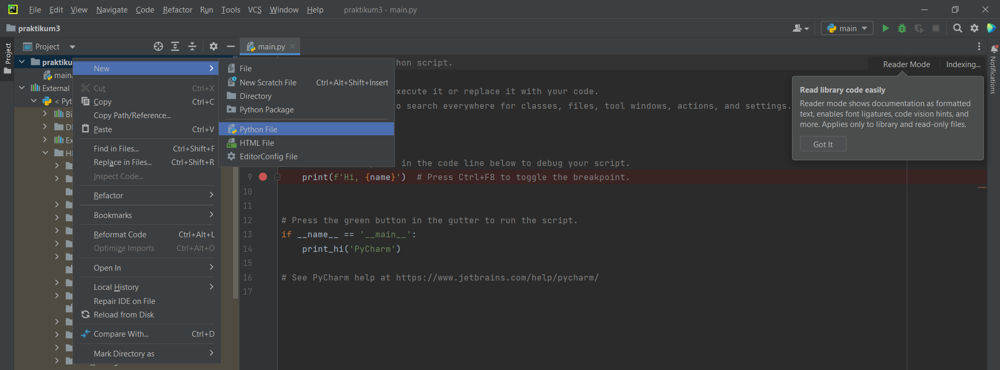

6. Masukan source code berikut:

# Penggunaan end
print('A', end='')
print('B', end='')
print('C', end='')
print()
print('X')
print('Y')
print('Z')

# Penggunaan separator
w, x, y, z = 10, 15, 20, 25
print(w, x, y, z)
print(w, x, y, z, sep=',')
print(w, x, y, z, sep='')
print(w, x, y, z, sep=':')
print(w, x, y, z, sep='-----')

# String format
print(0, 10 ** 0)
print(1, 10 ** 1)
print(2, 10 ** 2)
print(3, 10 ** 3)
print(4, 10 ** 4)
print(5, 10 ** 5)
print(6, 10 ** 6)
print(7, 10 ** 7)
print(8, 10 ** 8)
print(9, 10 ** 9)
print(10, 10 ** 10)

# String format
print('{0:>3} {1:>16}'.format(0, 10 ** 0))
print('{0:>3} {1:>16}'.format(1, 10 ** 1))
print('{0:>3} {1:>16}'.format(2, 10 ** 2))
print('{0:>3} {1:>16}'.format(3, 10 ** 3))
print('{0:>3} {1:>16}'.format(4, 10 ** 4))
print('{0:>3} {1:>16}'.format(5, 10 ** 5))
print('{0:>3} {1:>16}'.format(6, 10 ** 6))
print('{0:>3} {1:>16}'.format(7, 10 ** 7))
print('{0:>3} {1:>16}'.format(8, 10 ** 8))
print('{0:>3} {1:>16}'.format(9, 10 ** 9))
print('{0:>3} {1:>16}'.format(10, 10 ** 10))

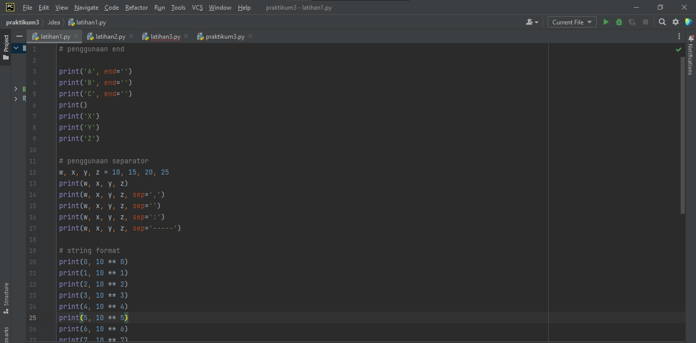
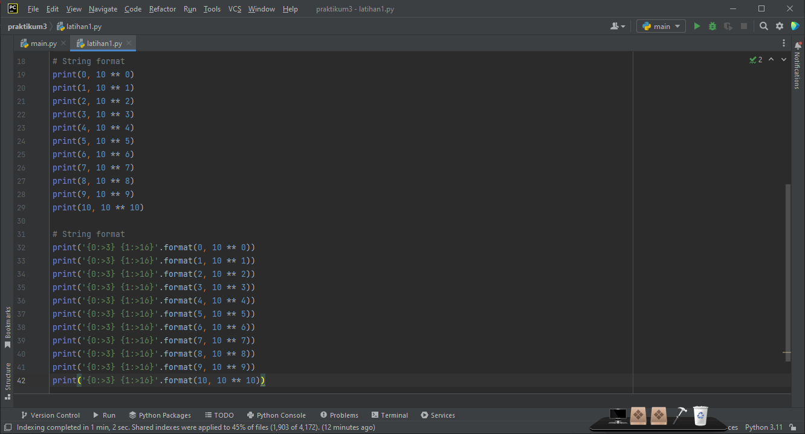

7. Lalu run

Hasil run

# Latihan 2
1. Buat new strach file "Latihan2.py"
2. Masukan source code berikut :
a=input("masukkan nilai a:")
b=input("masukkan nilai b:")
print("variabel a=",a)
print("variabel b=",b)
print("hasil penggabungan {1}&{0}=%s".format(a,b) %(a+b))

#konversi nilai variabel
a=int(a)
b=int(b)
print("hasil penjumlahan {1}+{0}=%s".format(a,b) %(a+b))
print("hasil penjumlahan {1}/{0}=%s".format(a,b) %(a/b))

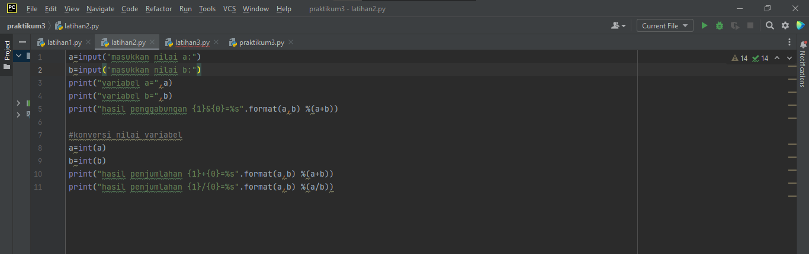

Hasil run

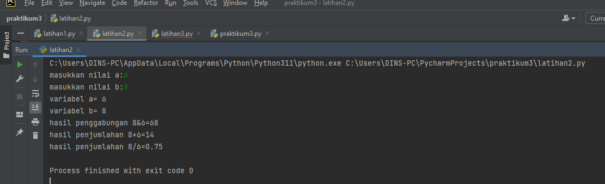

# Latihan 3
1. Buat new stracth "Latihan3.py"

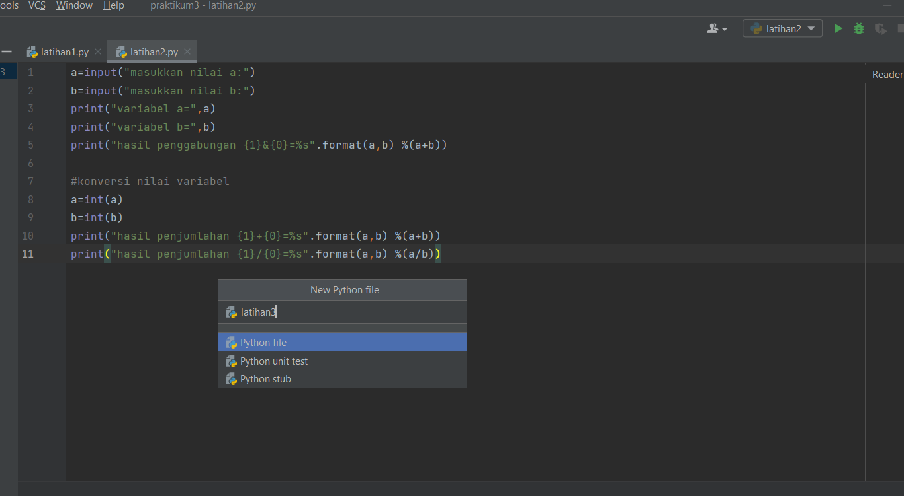

2. Masukan source code berikut :

string = ""

x = int(input("Masukkan angka :"))
bar = x

# Looping Baris
while bar >= 0:
# Looping Kolom Spasi Kosong
kol = bar
while kol > 0:
string = string + " "
kol = kol - 1
# Looping Kolom Bintang Sisi Kiri
kiri = 1
while kiri < (x - (bar-1)):
string = string + " * "
kiri = kiri + 1
# Looping Kolom Bintang Sisi Kanan
kanan = 1
while kanan < kiri -1:
string = string + " * "
kanan = kanan + 1

string = string + "\n\n"
bar = bar - 1

bar = 1
# Looping Baris
while bar <= x:
kol = bar+1
# Looping Kolom Spasi Kosong
while kol > 1:
string = string + " "
kol = kol - 1
# Looping Kolom Bintang Sisi Kiri
kiri = 0
while kiri < (x - bar):
string = string + " * "
kiri = kiri + 1
# Looping Kolom Bintang Sisi Kanan
kanan = kiri
while kanan > 1:
string = string + " * "
kanan = kanan - 1
string = string + "\n\n"
bar = bar + 1
print (string)

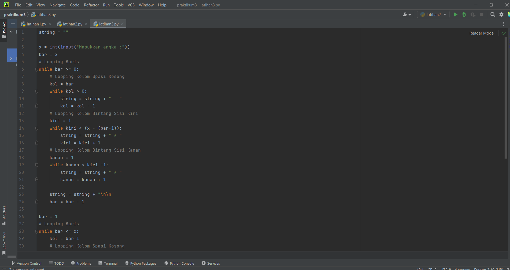
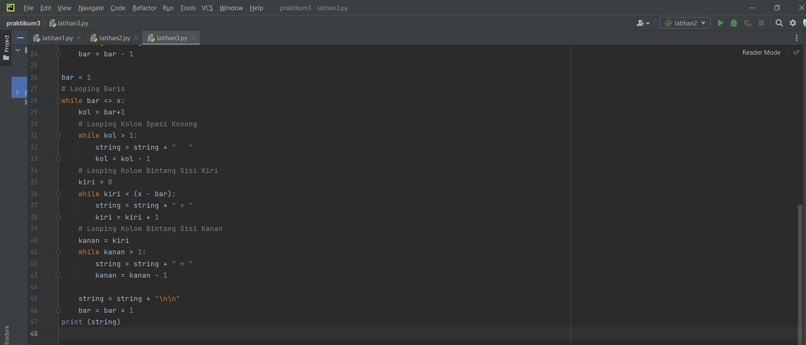

Hasil Run

## TUGAS PRAKTIKUM 3

## MENGHITUNG LUAS DAN KELILING LINGKARAN
1. Buat new stratch "Praktikum3.py"
2. Masukan source code berikut :
print('menghitung luas dan keliling lingkarang')
print('________________________________________')

r=float(input('masukkan nilai jari - jari :'))

phi=3.14
diameter=2*r

luas=phi*r*r
keliling=phi*2*r
print('\nluasnya =', str("%.2f" % luas))
print('kelilingnya =', str("%.2f" % keliling))

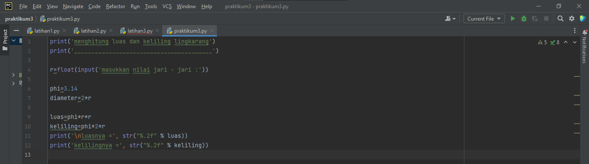

Hasil Run

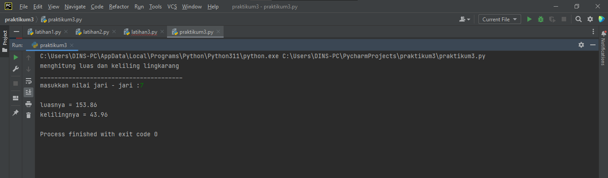

# Flowchart Menghitung luas dan keliling lingkaran

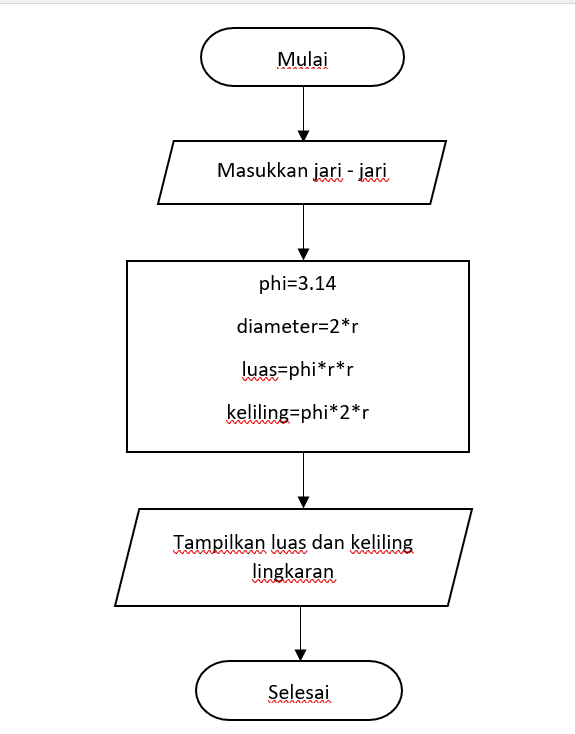

SELESAI!!

# LATIHAN-3
## TUGAS PERTEMUAN 4 BAHASA PEMOGRAMAN

Nama : Selma Ohoira

NIM : 312210727

Kelas : TI.22.C9

Prodi : Teknik Informatika

# Penjelasan Latihan-1
1. Masukkan nilai input.
2. Nilai input ini berfungsi untuk menampilkan banyak data.
Anda bisa memasukkan nilai berapa saja. Dengan menggunakan fungsi random.
3. Yakni, fungsi yang akan menampilkan angka dibawah 0.5 secara acak.
Fungsi random sudah otomatis ditampilkan.
4. Ketika Anda sudah memberikan input nilai, maka akan langsung muncul data nilai random.
Berikut hasilnya :

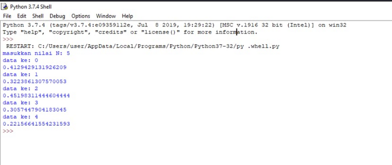

# Alur Pemograman/Flowchart Latihan-1

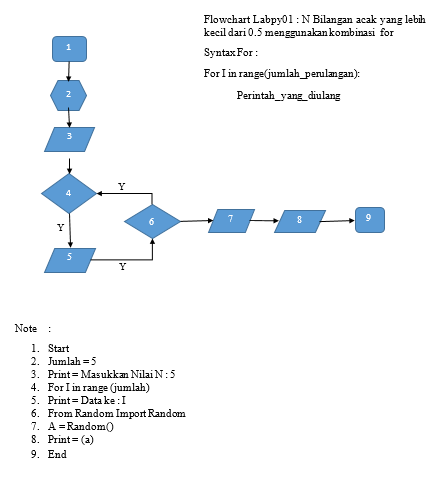

# Penjelasan latihan-2
1. Masukkan bilangan
2. Program akan terus mengulang untuk meminta anda memasukkan bilangan.
3. Pengulangan akan berhenti ketika anda memasukkan angka 0 (nol).
4. Lalu akan ditampilkan bilangan terbesar dari semua bilangan yang anda input.
Untuk mencari bilangan terbesar dari banyaknya bilangan menggunakan fungsi max.
Berikut hasilnya :

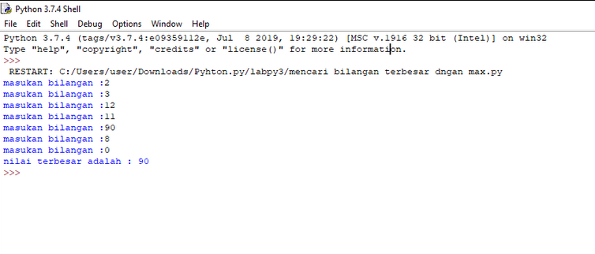

# Alur Pemograman/Flowchart Latihan-2

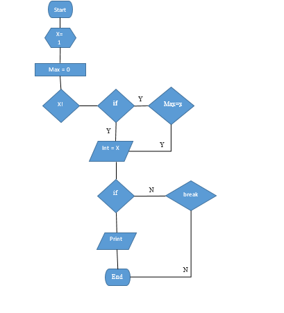

# Penjelasan program-3
1. Modal awal pengusaha sebesar Rp. 100.000.000
2. Untuk menghitung laba perbulan, maka harus diinputkan terlebih dahulu besarnya presentase keuntungan perbulan.
3. Selanjutnya, hasil laba perbulan akan ditampilkan.
Disini anda bisa menggunakan looping berupa for, untuk menampilkan kembali jumlah laba yang telah dihitung berdasarkan presentasenya.
4.Terakhir akan ditampilkan jumlah laba secara keseluruhan yang didapat dengan menggunakan sum.
Berikut hasilnya :

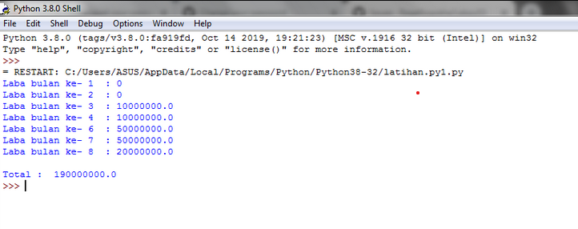

SELESAI !!