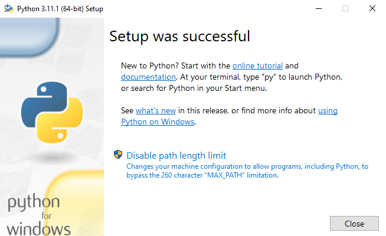

# lab2py
## TUGAS PERTEMUAN KE 5

Nama : Selma Ohoira

NIM : 312210727

Kelas : TI.22.C9

Mata Kuliah : Bahasa Pemograman

# CARA INSTALASI PYTHON
1. Bagi pengguna windows, buka situs resmi python (python.org)

2. Buka lalu centang bagian add python to PATH lalu klik install now

3. Instalasi selesai dan close

# Latihan (Menjalankan python console)
1. Masukan code: print ("Hello")
2. Masukan code: print ("Saya sedang belajar python")
untuk menampilkan output kata/ atau kalimat pada python
3. Selanjutnya masukan code berikut:
a = 8
b = 6
print ("variable a=",a)
print ("variable b=",b)
print ("hasil penjumlahan a+b=",a+b)
untuk menjumlahkan 2 buah bilangan menggunakan variabel a dan b

# MENJALANKAN IDLE (Latihan3)

SELESAI!!

# PRAKTIKUM 3
Langkah-langkahnya yaitu :
1. Install Pycharm di https://www.jetbrains.com/pycharm/download/#section=windows
2. Pilih yang community

Tunggu hingga selesai dan program siap digunakan.
## CARA MENJALANKAN PYCHARM
## Latihan 1
1. Klik new project
2. Ketik nama project sesuai yang diinginkan.

3. Pilih Previously Configurred interperter lalu klik yang "add interperter" dan pilih "System interperter"
4. Pilih yang versi Python, seperti gambar di bawah ini

5. Selanjutnya membuat file Phyton baru dan beri nama file "latihan1"
Masukan source code berikut:

# Penggunaan end
print('A', end='')
print('B', end='')
print('C', end='')
print()
print('X')
print('Y')
print('Z')

# Penggunaan separator
w, x, y, z = 10, 15, 20, 25
print(w, x, y, z)
print(w, x, y, z, sep=',')
print(w, x, y, z, sep='')
print(w, x, y, z, sep=':')
print(w, x, y, z, sep='-----')

# String format
print(0, 10 ** 0)
print(1, 10 ** 1)
print(2, 10 ** 2)
print(3, 10 ** 3)
print(4, 10 ** 4)
print(5, 10 ** 5)
print(6, 10 ** 6)
print(7, 10 ** 7)
print(8, 10 ** 8)
print(9, 10 ** 9)
print(10, 10 ** 10)

# String format
print('{0:>3} {1:>16}'.format(0, 10 ** 0))
print('{0:>3} {1:>16}'.format(1, 10 ** 1))
print('{0:>3} {1:>16}'.format(2, 10 ** 2))
print('{0:>3} {1:>16}'.format(3, 10 ** 3))
print('{0:>3} {1:>16}'.format(4, 10 ** 4))
print('{0:>3} {1:>16}'.format(5, 10 ** 5))
print('{0:>3} {1:>16}'.format(6, 10 ** 6))
print('{0:>3} {1:>16}'.format(7, 10 ** 7))
print('{0:>3} {1:>16}'.format(8, 10 ** 8))
print('{0:>3} {1:>16}'.format(9, 10 ** 9))
print('{0:>3} {1:>16}'.format(10, 10 ** 10))

7. Lalu run

Hasil run

# Latihan 2
1. Buat new strach file "Latihan2.py"
2. Masukan source code berikut :
a=input("masukkan nilai a:")
b=input("masukkan nilai b:")
print("variabel a=",a)
print("variabel b=",b)
print("hasil penggabungan {1}&{0}=%s".format(a,b) %(a+b))

#konversi nilai variabel
a=int(a)
b=int(b)
print("hasil penjumlahan {1}+{0}=%s".format(a,b) %(a+b))
print("hasil penjumlahan {1}/{0}=%s".format(a,b) %(a/b))

Hasil run

# Latihan 3
1. Buat new stracth "Latihan3.py"

2. Masukan source code berikut :

string = ""

x = int(input("Masukkan angka :"))
bar = x

# Looping Baris
while bar >= 0:
# Looping Kolom Spasi Kosong
kol = bar
while kol > 0:
string = string + " "
kol = kol - 1
# Looping Kolom Bintang Sisi Kiri
kiri = 1
while kiri < (x - (bar-1)):
string = string + " * "
kiri = kiri + 1
# Looping Kolom Bintang Sisi Kanan
kanan = 1
while kanan < kiri -1:
string = string + " * "
kanan = kanan + 1

string = string + "\n\n"
bar = bar - 1

bar = 1
# Looping Baris
while bar <= x:
kol = bar+1
# Looping Kolom Spasi Kosong
while kol > 1:
string = string + " "
kol = kol - 1
# Looping Kolom Bintang Sisi Kiri
kiri = 0
while kiri < (x - bar):
string = string + " * "
kiri = kiri + 1
# Looping Kolom Bintang Sisi Kanan
kanan = kiri
while kanan > 1:
string = string + " * "
kanan = kanan - 1
string = string + "\n\n"
bar = bar + 1
print (string)

Hasil Run

# TUGAS
## MENGHITUNG LUAS DAN KELILING LINGKARAN
1. Buat new stratch "Praktikum3"
2. Masukan source code berikut :
print('menghitung luas dan keliling lingkaran')
print('________________________________________')

r=float(input('masukkan nilai jari - jari :'))

phi=3.14
diameter=2*r

luas=phi*r*r
keliling=phi*2*r
print('\nluasnya =', str("%.2f" % luas))
print('kelilingnya =', str("%.2f" % keliling))

Hasil Run

# Flowchart Menghitung luas dan keliling lingkaran

SELESAI!!

# LATIHAN-3
## TUGAS PERTEMUAN 4 BAHASA PEMOGRAMAN

Nama : Selma Ohoira

NIM : 312210727

Kelas : TI.22.C9

Prodi : Teknik Informatika

# Penjelasan Latihan-1
1. Masukkan nilai input.
2. Nilai input ini berfungsi untuk menampilkan banyak data.
Anda bisa memasukkan nilai berapa saja. Dengan menggunakan fungsi random.
3. Yakni, fungsi yang akan menampilkan angka dibawah 0.5 secara acak.
Fungsi random sudah otomatis ditampilkan.
4. Ketika Anda sudah memberikan input nilai, maka akan langsung muncul data nilai random.
Berikut hasilnya :

# Alur Pemograman/Flowchart Latihan-1

# Penjelasan latihan-2
1. Masukkan bilangan
2. Program akan terus mengulang untuk meminta anda memasukkan bilangan.
3. Pengulangan akan berhenti ketika anda memasukkan angka 0 (nol).
4. Lalu akan ditampilkan bilangan terbesar dari semua bilangan yang anda input.
Untuk mencari bilangan terbesar dari banyaknya bilangan menggunakan fungsi max.
Berikut hasilnya :

# Alur Pemograman/Flowchart Latihan-2

# Penjelasan program-3
1. Modal awal pengusaha sebesar Rp. 100.000.000
2. Untuk menghitung laba perbulan, maka harus diinputkan terlebih dahulu besarnya presentase keuntungan perbulan.
3. Selanjutnya, hasil laba perbulan akan ditampilkan.
Disini anda bisa menggunakan looping berupa for, untuk menampilkan kembali jumlah laba yang telah dihitung berdasarkan presentasenya.
4.Terakhir akan ditampilkan jumlah laba secara keseluruhan yang didapat dengan menggunakan sum.
Berikut hasilnya :

SELESAI !!