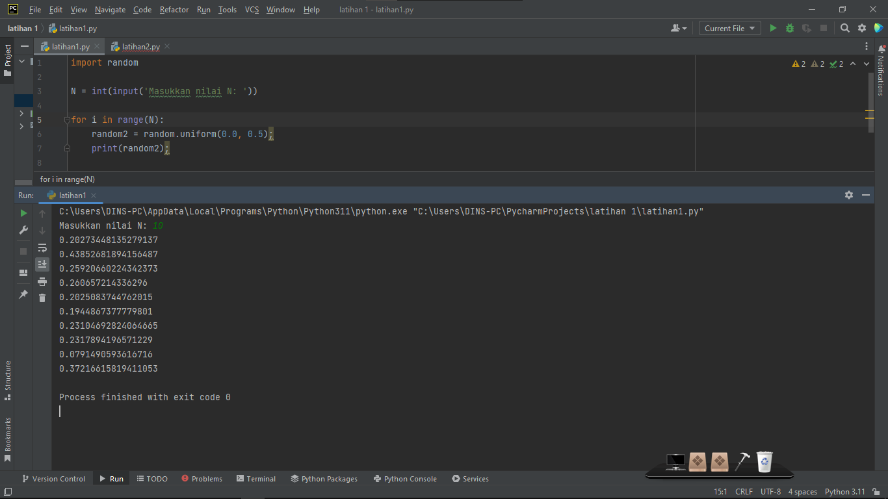
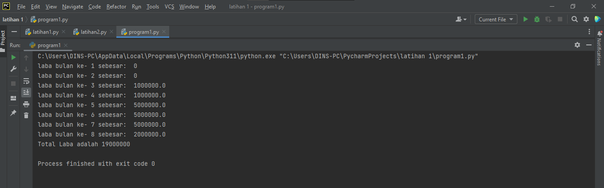

# lab2py
## TUGAS PERTEMUAN KE 5 & 6

Nama : Selma Ohoira

NIM : 312210727

Kelas : TI.22.C9

Mata Kuliah : Bahasa Pemograman

# CARA INSTALASI PYTHON
1. Bagi pengguna windows, buka situs resmi python (python.org)

2. Buka lalu centang bagian add python to PATH lalu klik install now

3. Instalasi selesai dan close

# Latihan (Menjalankan python console)
1. Masukan code: print ("Hello")
2. Masukan code: print ("Saya sedang belajar python")
untuk menampilkan output kata/ atau kalimat pada python
3. Selanjutnya masukan code berikut:
        a = 8
        b = 6
        print ("variable a=",a)
        print ("variable b=",b)
        print ("hasil penjumlahan a+b=",a+b)
untuk menjumlahkan 2 buah bilangan menggunakan variabel a dan b

# MENJALANKAN IDLE (Latihan3)

SELESAI!!

# PRAKTIKUM 3
Langkah-langkahnya yaitu :
1. Install Pycharm di https://www.jetbrains.com/pycharm/download/#section=windows
2. Pilih yang community

Tunggu hingga selesai dan program siap digunakan.
## CARA MENJALANKAN PYCHARM
## Latihan 1
1. Klik new project
2. Ketik nama project sesuai yang diinginkan.

3. Pilih Previously Configurred interperter lalu klik yang "add interperter" dan pilih "System interperter"
4. Pilih yang versi Python, seperti gambar di bawah ini

5. Selanjutnya membuat file Phyton baru dan beri nama file "latihan1"

Masukan source code berikut:

    # Penggunaan end
    print('A', end='')
    print('B', end='')
    print('C', end='')
    print()
    print('X')
    print('Y')
    print('Z')

    # Penggunaan separator
    w, x, y, z = 10, 15, 20, 25
    print(w, x, y, z)
    print(w, x, y, z, sep=',')
    print(w, x, y, z, sep='')
    print(w, x, y, z, sep=':')
    print(w, x, y, z, sep='-----')

    # String format
    print(0, 10 ** 0)
    print(1, 10 ** 1)
    print(2, 10 ** 2)
    print(3, 10 ** 3)
    print(4, 10 ** 4)
    print(5, 10 ** 5)
    print(6, 10 ** 6)
    print(7, 10 ** 7)
    print(8, 10 ** 8)
    print(9, 10 ** 9)
    print(10, 10 ** 10)

    # String format
    print('{0:>3} {1:>16}'.format(0, 10 ** 0))
    print('{0:>3} {1:>16}'.format(1, 10 ** 1))
    print('{0:>3} {1:>16}'.format(2, 10 ** 2))
    print('{0:>3} {1:>16}'.format(3, 10 ** 3))
    print('{0:>3} {1:>16}'.format(4, 10 ** 4))
    print('{0:>3} {1:>16}'.format(5, 10 ** 5))
    print('{0:>3} {1:>16}'.format(6, 10 ** 6))
    print('{0:>3} {1:>16}'.format(7, 10 ** 7))
    print('{0:>3} {1:>16}'.format(8, 10 ** 8))
    print('{0:>3} {1:>16}'.format(9, 10 ** 9))
    print('{0:>3} {1:>16}'.format(10, 10 ** 10))

7. Lalu run

Hasil output latihan1

# Latihan 2
1. Buat new strach file "Latihan2"
2. Masukan source code berikut :

    a=input("masukkan nilai a:")
    b=input("masukkan nilai b:")
    print("variabel a=",a)
    print("variabel b=",b)
    print("hasil penggabungan {1}&{0}=%s".format(a,b) %(a+b))

    #konversi nilai variabel
    a=int(a)
    b=int(b)
    print("hasil penjumlahan {1}+{0}=%s".format(a,b) %(a+b))
    print("hasil penjumlahan {1}/{0}=%s".format(a,b) %(a/b))

Hasil output latihan2

# Latihan 3
1. Buat new stracth "Latihan3"
2. Masukan source code berikut :

    string = ""

    x = int(input("Masukkan angka :"))
    bar = x

    # Looping Baris
    while bar >= 0:
    # Looping Kolom Spasi Kosong
    kol = bar
    while kol > 0:
    string = string + " "
    kol = kol - 1
    # Looping Kolom Bintang Sisi Kiri
    kiri = 1
    while kiri < (x - (bar-1)):
    string = string + " * "
    kiri = kiri + 1
    # Looping Kolom Bintang Sisi Kanan
    kanan = 1
    while kanan < kiri -1:
    string = string + " * "
    kanan = kanan + 1

    string = string + "\n\n"
    bar = bar - 1

    bar = 1
    # Looping Baris
    while bar <= x:
    kol = bar+1
    # Looping Kolom Spasi Kosong
    while kol > 1:
    string = string + " "
    kol = kol - 1
    # Looping Kolom Bintang Sisi Kiri
    kiri = 0
    while kiri < (x - bar):
    string = string + " * "
    kiri = kiri + 1
    # Looping Kolom Bintang Sisi Kanan
    kanan = kiri
    while kanan > 1:
    string = string + " * "
    kanan = kanan - 1
    string = string + "\n\n"
    bar = bar + 1
    print (string)

Hasil output latihan3

# TUGAS
## MENGHITUNG LUAS DAN KELILING LINGKARAN
1. Buat new stratch "Praktikum3"
2. Masukan source code berikut :

        print('menghitung luas dan keliling lingkaran')
        print('________________________________________')

        r=float(input('masukkan nilai jari - jari :'))

        phi=3.14
        diameter=2*r

        luas=phi*r*r
        keliling=phi*2*r
        print('\nluasnya =', str("%.2f" % luas))
        print('kelilingnya =', str("%.2f" % keliling))

Hasil Run

# Flowchart menghitung luas dan keliling lingkaran

SELESAI!!

# LATIHAN-3
## TUGAS LATIHAN1.PY, LATIHAN2.PY, & PROGRAM1.PY

## Latihan1.py

Tampilkan N bilangan acak kurang dari 0,5.

Import Random.

    import random;

Masukan nilai N.

    N = int(input('Masukkan nilai N: '));

Looping nilai N menggunakan For.

    for i in range(N)

Random dengan random.uniform dengan range 0.0 - 0.5.

    random2 = random.uniform(0.0, 0.5);

Print hasil random.

    print(random2);

# Hasil output latihan1.py

# Flowchart latihan1.py

# Latihan2.py
Program untuk menampilkan bilangan terbesar dari N buah data yang diinputkan. Masukkan angka 0 untuk berhenti.

Buat variabel Array.

    number = [];

Looping menggunakan While dengan kondisi True.

    while True

Input nomor untuk dimasukan ke dalam Array.

    numberInput = int(input('Masukkan Bilangan: '));
    number.append(numberInput);

Menggunakan logif If saat input == 0.

    if numberInput == 0:

Membuat Perulangan dengan For untuk menentukan angka terbesar dalam Array.

    max2 = number[0];
    for b in range(0, len(number)):        
        if(number[b] > max2):    
            max2 = number[b];    

Menampilkan Angka Terbesar.

    print('Bilangan Terbesar adalah', max2);

Menghentikan While dengan Breaks saat input == 0.

    if numberInput == 0:
            max2 = number[0];
            for b in range(0, len(number)):        
                if(number[b] > max2):    
                    max2 = number[b];    
            print('Bilangan Terbesar adalah', max2);
            break;

# Hasil output latihan2.py

# Flowchart latihan2.py

# Program1.py
Program sederhana dengan perulangan. Seorang pengusaha menginvestasikan uangnya untuk memulai usahanya dengan modal awal 100 juta, pada bulan pertama dan kedua belum mendapatkan laba. pada bulan ketiga baru mulai mendapatkan laba sebesar 1% dan pada bulan ke 5, pendapatan meningkat 5%, selanjutnya pada bulan ke 8 mengalami penurunan keuntungan sebesar 2%, sehingga laba menjadi 3%. Hitung total keuntungan selama 8 bulan berjalan usahanya.

Buat variabel Modal, dan laba.

    modal = 100000000;
    laba = 0;

Looping menggunakan For Range dengan kondisi 9x loops.

    for i in range (9):

Menggunakan Pengkondisian ketika perulangan.

    if i == 1 or i == 2:
    ...
    elif i > 2 and i < 5:
    ...
    elif i > 4 and i < 8:
    ...
    elif i == 8:
    ...

Mencetak besaran laba tiap loop.

    print("laba bulan ke-",i, "sebesar: ", 0);

Membuat perhitungan laba dan menyimpannya pada variabel laba.

    temp = modal * 1 / 100;
    laba += temp;  

Menampilkan Total Hasil Laba.

    print('Total Laba adalah', laba);

# Hasil Output Program1.py

SELESAI !!